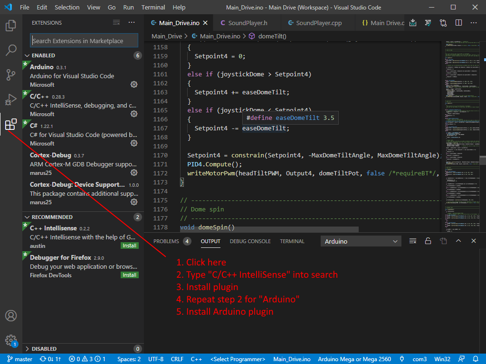
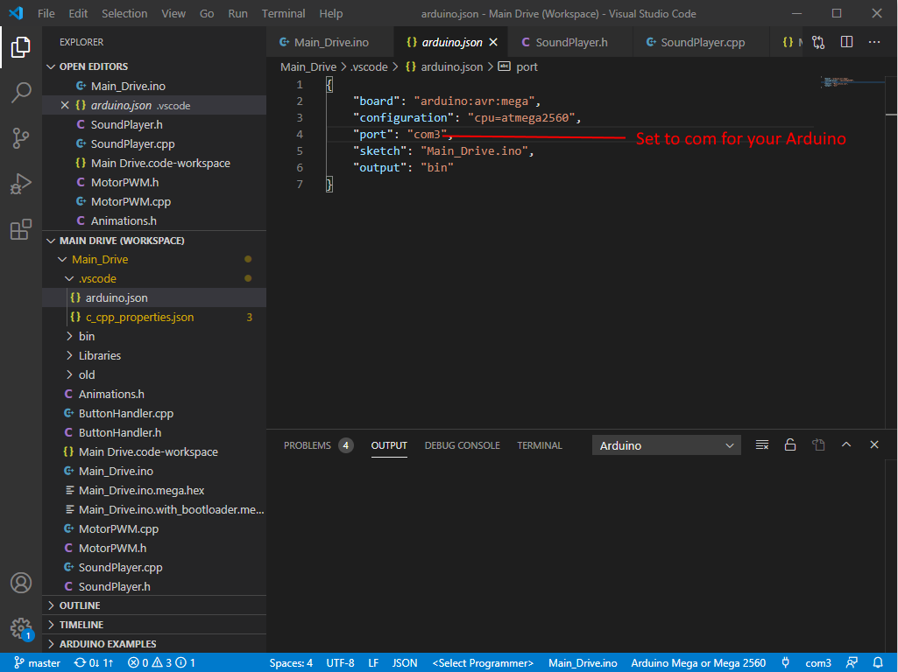
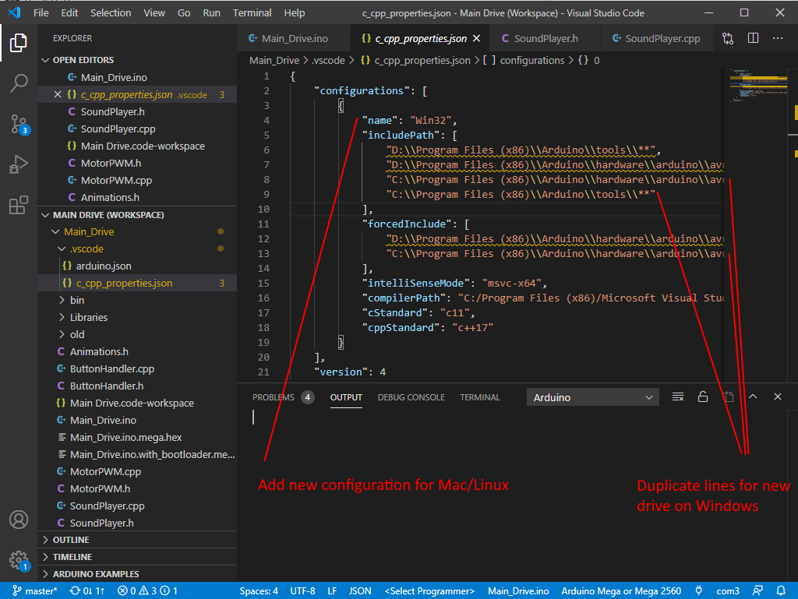

# JoesDrive
Modifications to Joe's Drive, including the code changes to make the flywheel MK3 I developed work correctly

This will conttain all the code for my Joe's drive setup. I started pretty early and have some custom stuff. My layout is as follows:

## Hardware setup
The following goes over the current hardware I am actively using in my drive and remote.

### Arduino Mega
The Arduino Mega 2650 is the main brains of the drive, and it is responsible for handling the remote functions and reading the IMU sub-board from the serial terminals.

It currently has 6 digital I/0 lines (with a resistor) going into my custom Igniter 3 BB-8 sound generator to play sounds and music independently. This means BB-8 can still 'talk' while music is playing.

The code for this Mega is in the folder Main_Drive in this repository (keeping with Joe's naming)

### Arduino Pro Mini - IMU reader
Between MK2 and MK3 head update, Joe split the IMU to a separate Pro Mini. I incorporated this change as it is much safer to get the IMU data via serial from the Mega, as if the IMU locks it won't cause the drive to go wonky, it will just stop.

This code is NOT included in this repository, as it is 100% the same at this point as when Joe created it. If I need to make customizations I will add it here.

### Arduino Pro Mini - Remote
I'm using the original remote from Joe that is run off an Arduino Pro Mini (5v). This is the single remote with two Audafruit sticks, one OLED display, and a small PSP stick on back to do the flywheel. It connects to the main drive with a paired Bluetooth module.

Note that this is NOT the most current setup in Joe's drive, as he moved to dual remotes with feathers, to communicate with the main drive which is also now a feather I believe.
The code for this is under BB8_remote, to keep consistent with Joe's naming.

### Customized I2 and I3 boards
I have two customized I2 boards, one running the lights in the body and one running the lights in the dome. These connect with an XBee Zigbee mesh network to the I3 in the drive. All of these are using NEC code so for now I won't share this but anyone that wants the boards can get some from me at a good price, with the custom firmware loaded.

## Naigon's Code Changes
To find code changes made from Joe's drive, there are a few ways to do this.

First, by using a git enlistment viewer you can see my check-ins vs the original check-in, which is the file as provided by Joe (From approx 26 Sept 2017). This will allow you to see the discrete works I commited to the repo. I recommend [SourceTree](https://www.sourcetreeapp.com/) for both Windows and Mac OS.

Second, you can navigate the comments in the code, as I have commented per feature. All comments I have added are in the format

`Naigon - <Feature>`

where <Feature> is the feature name, or blank for general clean up. The feature table below shows the features you can search for.

This is applicapable to both */BB8_remote/BB8_remote.ino* and */Main_Drive/Main_Drive.ino*.

## New Features
The following are the new features that I have added into my drive to make it more usable.
Feature | Description
------- | -----------
MK3 Flywheel | Code changes required to get the drive working after physically installing the Naigon MK3 Flywheel.
NEC Audio | Code that drives the custom audio player built off an Igniter 3 (contact if you wish to purchase).
Drive-Side (Server-Side) Refactor | Drive mode, Fwd/Reverse, and calibration selection driven from the server. Think of turning the remote into a "dumb" react-like terminal.
Animations | (In progress) Canned animations that allow a single button press to do animatronics.
Stationary/Wiggle Mode | Extra drive speed that when selected disables the rear PSP flywheel stick, and moves flywheel to the drive stick. No driving in this mode. NOTE: In the code it is called 'Stationary' mode, but the remote displays it as 'Wiggle'.
Safe Mode | Extra drive speed that when selected disables remote input, and only engages the main drive stability. This allows pushing the ball safely to allow a specific panel to be facing up for access. In the code it is called 'PushToRoll' but the remote displays 'Safe'.
Safe Joystick Button Toggle | New feature that prevents the two joysticks from registering a press when the joystick is in use. This prevents accidently reversing the controls during drive, and prevents going into servo mode when using the dome.
Head Tilt Stability | Keeps the dome centered forward to back regardless of the body underneath (mostly). This mainly prevents the head from dipping backwards when starting rolling.

## Visual Studio Code
As a big proponent of Visual Studio Code and someone that finds the Arduino IDE quite lacking, I have moved all my Arduino development to Visual Studio Code.

If you want to use Visual Studio Code as well, you first need to download the installer.

On Windows, I recommend the version for all users if this is for your computer, but if you work on a shared computer or one that is owned by your work then you might need the version for just yourself.

https://code.visualstudio.com/

For Mac or Linux, there is only a single version, so it is a bit simpler.

In all cases, you do need to first install the full Arduino IDE as it installs all the necessary prerequisites.

### Install Required Plugins
After installing VS Code, you can install the C/C++ IntelliSense and Arduino plug-ins. click the plugin button on the left bar, and then search for "C/C++ IntilliSense". On the main window, click install for this plugin. Repeat the process for "Arduino".

### Updating .vscode Files
Because I didn't setup a build system, there are a couple files you will need to modify manually for your system.

First, you need to update the com port that your Arduino and Arduino Pro Mini attach to your computer as. You can update this in the `.vscode/arduino.json` file in both the main drive and remote's code.

Finally, if you have your Arduino installed into a drive other and C or D, or you are using Mac or Linux, you will need to update `.vscode/c_cpp_properties.json` as well.

For Windows, you can just copy the c:\ directory for each path in both "includePath" and "forcedInclude".

For Mac/Linux, you will need to add an entirely new entry to "configurations". I'll leave that to the end user for now, but in the future, I should be able to get those checked in (at least for Mac which I do run here as well).

